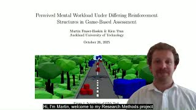

# Martin Fraser-Hoskin — Portfolio

Welcome to my portfolio repository.  
This repo collects my publications, demos, and supporting media which I reference in job applications, research profiles, and my CV.

---

## Publications

### 1. Perceived Mental Workload Under Differing Reinforcement Structures in Game-Based Assessment (2025)
This was my research project for my PGDipSci at AUT, supervised by Kien Tran. 

**➡️ [Read the full PDF](sha256:8e7149643f30d6892c80b99cfec0e1ce2785609482d25e5dc138eb2aff114362)**

---

## Demo Video

Below is a demo video showing the work involved in the study behind the above publication.

*Click thumbnail to watch on YouTube (unlisted).*

---
